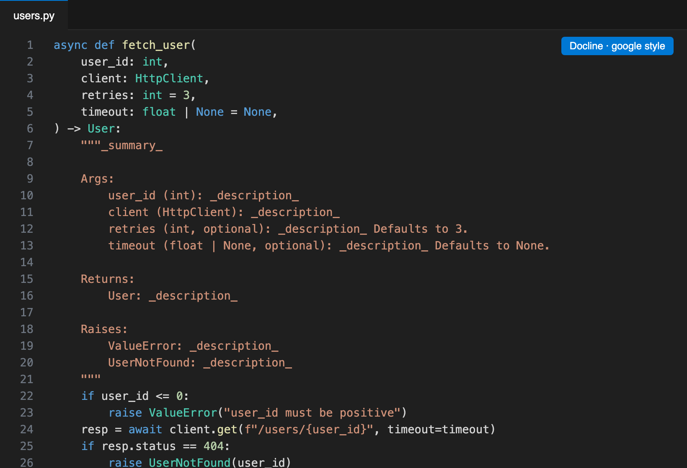
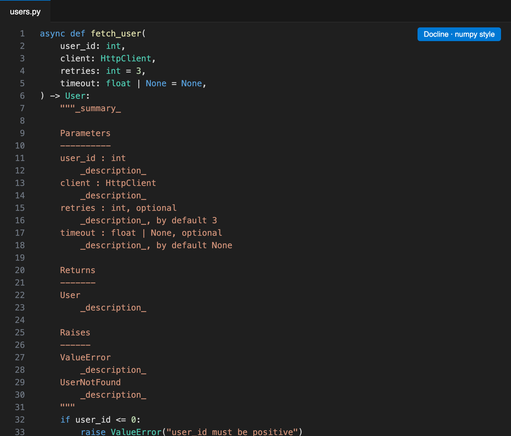

# Docline — Instant Python Docstrings

**Type `"""` under a function and get a complete docstring.** Docline reads your signature and body — parameters, type hints, defaults, return type, `yield`s and `raise`s — and writes a Google, NumPy or Sphinx docstring with tab stops for every description.

A fast, **actively maintained** alternative to autoDocstring. Works offline, no AI or API keys needed.

## How to use

- Type `"""` (or `'''`) on the line under a `def` or `class` → pick **Generate Docstring**.
- Or put the cursor in a function and press <kbd>Ctrl+Shift+2</kbd> / <kbd>⌘⇧2</kbd> (same shortcut as autoDocstring), or right-click → **Generate Docstring**.
- Press <kbd>Tab</kbd> to jump between the summary and each description.

## What it understands

- Multi-line signatures, `async def`, methods (`self`/`cls` skipped), classes
- Type hints of any complexity (`dict[str, list[int]]`, `float | None`, …) and default values
- `*args`, `**kwargs`, keyword-only `*` and positional-only `/` markers
- `return` values (not bare/None returns), `yield` → **Yields** with the element type from `Iterator[T]` / `Generator[T, …]`
- `raise` statements → **Raises** — ignoring nested functions, strings and comments

## Styles

Set `docline.style` to `google` (default), `numpy` or `sphinx`.

## Docline Pro

Part of the one-time **Branchline Pro** license (no subscription):

- **Document an entire file at once** — right-click → *Generate Docstrings for Entire File* adds docstrings to every undocumented function and class.
- Pro features in [Branchline — Git Graph](https://marketplace.visualstudio.com/items?itemName=branchline.branchline), [TODO Lens](https://marketplace.visualstudio.com/items?itemName=branchline.todo-lens) and [Snapline](https://marketplace.visualstudio.com/items?itemName=branchline.snapline-code-screenshots) too.

Run **`Docline: Get Docline Pro`**, then **`Docline: Enter Pro License Key`**.

## Settings

| Setting | Default | Description |
| --- | --- | --- |
| `docline.style` | `google` | `google`, `numpy` or `sphinx` |
| `docline.includeTypes` | `true` | Copy type hints into the docstring |
| `docline.placeholder` | `_description_` | Placeholder text for descriptions |

## Also by the author

- **[Branchline — Git Graph](https://marketplace.visualstudio.com/items?itemName=branchline.branchline)** — a fast, maintained Git Graph.
- **[TODO Lens — Better Comments & TODO Tree](https://marketplace.visualstudio.com/items?itemName=branchline.todo-lens)** — color-coded comments and every TODO in one tree.
- **[Snapline — Code Screenshots](https://marketplace.visualstudio.com/items?itemName=branchline.snapline-code-screenshots)** — beautiful code images in your editor's theme.

## Support

Free and maintained by one developer. If it saves you time, you can [chip in from $1](https://dealership6.gumroad.com/l/support).

## License

Source-available under the [Docline License](LICENSE): free to use, read and learn from; redistribution and derivative publications are not permitted.
